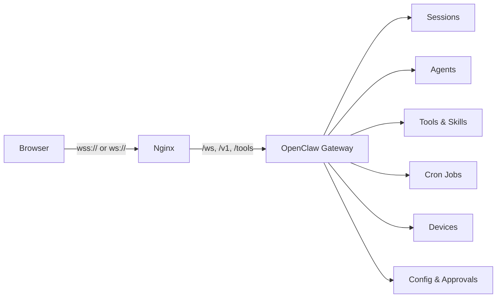

<div align="center">
  <h1>MarkOS UI</h1>
  <p><strong>Agent Operating System UI for OpenClaw</strong></p>
  <p>Build, monitor, and orchestrate AI agents from a polished dashboard with live gateway connectivity and one-click deployment.</p>

  <p>
    <a href="https://github.com/mktt-ai-global/MarkOS-UI/stargazers"></a>
    <a href="https://github.com/mktt-ai-global/MarkOS-UI/blob/main/LICENSE"></a>
    <a href="https://github.com/mktt-ai-global/MarkOS-UI/actions/workflows/ci.yml"></a>
    <a href="https://github.com/mktt-ai-global/MarkOS-UI/releases/latest"></a>
    
    
  </p>

  <p>
    <a href="#quick-start">Quick Start</a> &middot;
    <a href="#features">Features</a> &middot;
    <a href="#deploy-modes">Deploy</a> &middot;
    <a href="#development">Development</a> &middot;
    <a href="./README.zh-CN.md">中文文档</a>
  </p>
</div>


## Quick Start

### One-Line Install

```bash
bash <(curl -fsSL https://raw.githubusercontent.com/mktt-ai-global/MarkOS-UI/main/install.sh)
```

The interactive installer lets you pick a mode (Local / VPS / Docker), configure ports, and optionally bootstrap OpenClaw — all with a deployment summary before any changes are made.

### Docker

```bash
cp .env.example .env   # edit ports if needed
docker compose up -d
```

Open `http://localhost:4173` and connect to your gateway.

### VPS with HTTPS

```bash
bash <(curl -fsSL https://raw.githubusercontent.com/mktt-ai-global/MarkOS-UI/main/install.sh) \
  --mode vps --domain ai.example.com --email ops@example.com
```

This builds the frontend, configures Nginx with reverse proxy, installs a systemd gateway service, issues a Let's Encrypt certificate, and enables auto-renewal.

## Features

### Live Gateway Integration

MarkOS UI connects to the OpenClaw gateway over WebSocket. When connected, every page shows real-time data. When disconnected, it falls back to local mock data so you can still explore the UI.

- **Dashboard** — nodes, sessions, agents, skills, performance metrics
- **Agents** — browse agents from `agents.list`, inspect sessions and token usage
- **Skills** — tools catalog from the gateway, grouped by category
- **Chat** — real-time messaging via `chat.send` / `chat.history`, live event streaming
- **Cron** — scheduled tasks with create/update/run/delete operations
- **Devices** — paired and pending browser devices from `device.pair.list`
- **Approvals** — execution approval policies from `exec.approvals.get`
- **Settings** — live config viewer, connection management, gateway schema editor

### Smart Connectivity

- Auto-detects deployment: `ws://localhost:18789` for dev, `wss://<domain>/ws` for production
- Ed25519 device signing (v2 protocol, compatible with OpenClaw 2026.3.23+)
- Auto-recovery from stale device identity (no manual cache clearing needed)
- Token-based authentication via URL hash (`#token=...`) for easy first-time setup

### Template Studio

Create agent and skill templates through a structured questionnaire or by importing existing files (`.md`, `.txt`, `.json`, `.yaml`, `.yml`, `.rtf`). Preview generated artifacts and download as a pack.

### Design System

- Glassmorphism UI with `frost` (light) and `midnight` (dark) themes
- `glass-input` components with focus glow effects
- Responsive layout for desktop and mobile
- Smooth animations via Framer Motion

## Deploy Modes

| Mode | Best For | What It Does |
|------|----------|--------------|
| `local` | Laptop demo, testing | Builds the app, optionally starts OpenClaw, runs a preview server |
| `vps` | Public deployment | Nginx reverse proxy + systemd service + HTTPS auto-renew |
| `docker` | Container-based setup | Nginx container with gateway proxy and healthcheck |
| `config` | Manual rollout | Generates Nginx and systemd config files only |

### CLI Examples

```bash
# Local with custom ports
./install.sh --mode local --host 0.0.0.0 --ui-port 5000 --gateway-port 19000

# VPS with domain
./install.sh --mode vps --domain ai.example.com --email ops@example.com

# Docker with custom port
./install.sh --mode docker --ui-port 8080

# Config generation only
./install.sh --mode config --domain ai.example.com
```

### Docker Configuration

Copy `.env.example` to `.env` and edit:

```env
MARKOS_UI_PORT=4173                          # Browser access port
OPENCLAW_UPSTREAM_HOST=host.docker.internal   # Gateway host
OPENCLAW_UPSTREAM_PORT=18789                  # Gateway port
```

The Nginx container includes gzip compression, static asset caching, security headers, a `/healthz` endpoint, and WebSocket proxy with keepalive.

## Architecture



## Tech Stack

| Layer | Technology |
|-------|-----------|
| Frontend | React 19, TypeScript |
| Build | Vite 8 |
| Styling | Tailwind CSS 4 |
| Routing | React Router 7 |
| Charts | Recharts 3 |
| Animation | Framer Motion |
| Deployment | Nginx, Docker Compose, systemd |

## Development

```bash
git clone https://github.com/mktt-ai-global/MarkOS-UI.git
cd MarkOS-UI
npm ci
npm run dev
```

Open [http://localhost:5173](http://localhost:5173). The dev server proxies `/ws`, `/v1`, and `/tools` to `localhost:18789`.

### Scripts

| Command | Description |
|---------|-------------|
| `npm run dev` | Start dev server |
| `npm run build` | Production build |
| `npm run preview` | Preview production build |
| `npm run lint` | ESLint check |
| `npm run test` | Run tests |
| `npm run check` | Lint + test + build |
| `npm run docker:up` | Build and start Docker stack |

### Project Structure

```
src/
  pages/         Route-level pages (Dashboard, Agents, Skills, Chat, etc.)
  components/    Shared UI components (GlassCard, Sidebar, TopBar, etc.)
  lib/           Gateway client, adapters, storage, template engine
  hooks/         React hooks for gateway data and events
deploy/          Nginx and systemd templates
docker/          Container runtime configuration
tests/           Unit tests
```

## Release Workflow

- PRs and pushes run [`ci.yml`](./.github/workflows/ci.yml) (lint + typecheck + test + build)
- Version tags (`vX.Y.Z`) trigger [`release.yml`](./.github/workflows/release.yml)
- Manual packaging: `./scripts/package-release.sh HEAD vX.Y.Z`

## Contributing

See [CONTRIBUTING.md](./CONTRIBUTING.md) for guidelines.

## Security

See [SECURITY.md](./SECURITY.md) for vulnerability reporting.

## License

[MIT](./LICENSE)
