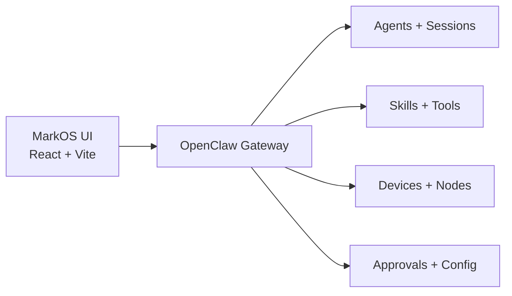

<div align="center">
  <h1>MarkOS UI</h1>
  <p><strong>The visual control plane for OpenClaw-powered agent systems.</strong></p>
  <p>Build, monitor, and orchestrate AI agents from a polished dashboard that works with both live gateway snapshots and offline mock data.</p>
  <p>一个开箱可用、适合展示与扩展的 AI Agent 可视化操作台。</p>

  <p>
    <a href="https://github.com/mktt-ai-global/MarkOS-UI/actions/workflows/ci.yml"></a>
    <a href="https://github.com/mktt-ai-global/MarkOS-UI/stargazers"></a>
    <a href="https://github.com/mktt-ai-global/MarkOS-UI/blob/main/LICENSE"></a>
    
    
    
  </p>
</div>


## Why MarkOS UI

Most agent runtimes are powerful but invisible. MarkOS UI makes them operable.

It turns your OpenClaw gateway into a dashboard-first experience with live system visibility, template-driven agent creation, session previews, device oversight, approvals scaffolding, and a UI language that already feels product-ready on desktop and mobile.

The goal is simple: make agent infrastructure feel as understandable as modern cloud ops.

## What You Get

- **Live dashboard with graceful fallback**: monitor nodes, sessions, skills, gateway health, and derived metrics, even when the gateway is offline.
- **Agent workspace**: browse agent state, inspect activity, and build reusable local agent templates with questionnaire-driven flows.
- **Skill studio**: manage skill templates, import structured files, and prepare reusable skill packs before wiring runtime install actions.
- **Chat console**: inspect session history, start offline sessions from templates, draft session overrides, and preview live monitor behavior.
- **Cron preview**: model scheduled jobs, toggle runs locally, and validate schedule drafts before binding to a real gateway.
- **Device and approval surfaces**: ship a complete UI shell for trusted devices and human approval queues with live-readiness in mind.
- **Template import/export pipeline**: import `.md`, `.txt`, `.json`, `.yaml`, `.yml`, or `.rtf`, generate artifacts, export packs, and re-import with questionnaire state.
- **Release-friendly frontend stack**: React 19, TypeScript, Vite 8, Tailwind CSS 4, Recharts, Framer Motion, and a polished frosted-glass interface.

## Release Status

This release is ready for GitHub publishing and team adoption as a UI project.

- `npm run check` passes locally.
- The app is production-buildable and deployable as a static frontend.
- Mock fallback is built in, so the full product surface is explorable without a live gateway.
- Runtime-changing actions that depend on exact OpenClaw RPC contracts remain intentionally gated until validated against a real local gateway.

That means MarkOS UI is already strong as a product showcase, internal control panel, or frontend foundation for a richer agent platform.

## Quick Start

```bash
git clone https://github.com/mktt-ai-global/MarkOS-UI.git
cd MarkOS-UI
npm ci
npm run dev
```

Open [http://localhost:5173](http://localhost:5173)

## One-Command Install

```bash
./install.sh
```

The installer:

1. Verifies Node.js and npm
2. Detects or installs OpenClaw
3. Runs onboarding when needed
4. Installs locked UI dependencies
5. Builds the production bundle
6. Starts the gateway if needed
7. Serves the UI with `vite preview`

For VPS deployment guidance:

```bash
./install.sh --deploy-guide
```

## Architecture



When a live gateway is available, MarkOS UI reads snapshots and events from OpenClaw. When it is not, the app falls back to local mock data and browser-persisted drafts so work on UI flows, templates, and product reviews never blocks on infrastructure.

## Experience Highlights

- **Dashboard-first UX** with clean cards, charts, and density tuned for operators rather than demos.
- **Responsive layout** with desktop sidebar navigation and mobile-friendly bottom navigation behavior.
- **Theme support** with Frost and Midnight modes.
- **Error boundary and notification system** for safer runtime behavior and clearer operator feedback.
- **Template-first workflows** that make the product useful before every backend mutation path is finalized.

## Tech Stack

| Layer | Technology |
| --- | --- |
| App | React 19 + TypeScript |
| Build | Vite 8 |
| Styling | Tailwind CSS 4 |
| Routing | React Router 7 |
| Charts | Recharts 3 |
| Motion | Framer Motion |
| Quality | ESLint + Node test runner |

## Project Structure

```text
src/pages        Route-level product surfaces
src/components   Shared UI building blocks
src/lib          Gateway client, adapters, storage, template helpers
src/hooks        Gateway-facing React hooks
tests            Local logic coverage for adapters, storage, and template flows
public           Static assets
```

## Scripts

```bash
npm run dev        # Start the Vite dev server
npm run lint       # Lint the codebase
npm run test       # Run local unit tests
npm run build      # Typecheck and build production assets
npm run check      # Lint + test + build
npm run preview    # Preview the production build
```

## Roadmap

- Validate live write operations against a real OpenClaw gateway
- Replace derived UI estimates with verified backend telemetry
- Expand approvals, devices, and runtime install flows from scaffolding to full control
- Add deeper session analytics and agent runtime observability

## License

[MIT](./LICENSE)
