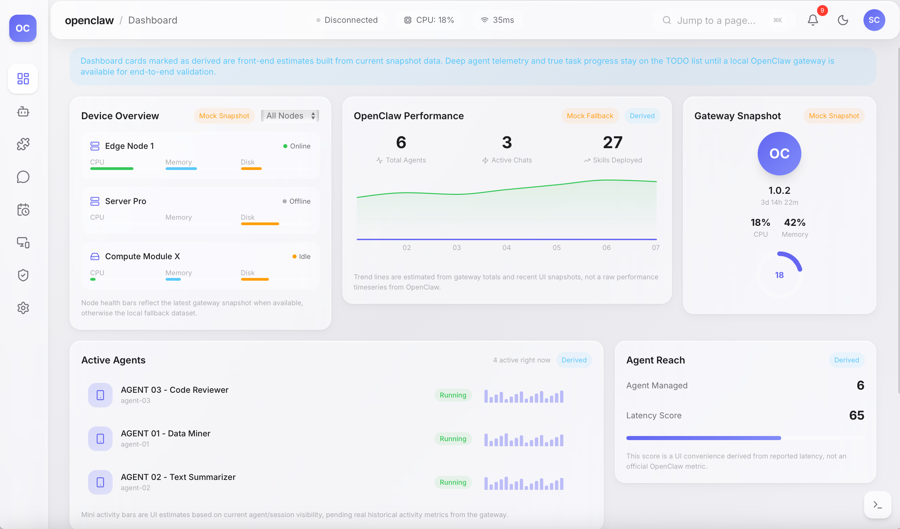
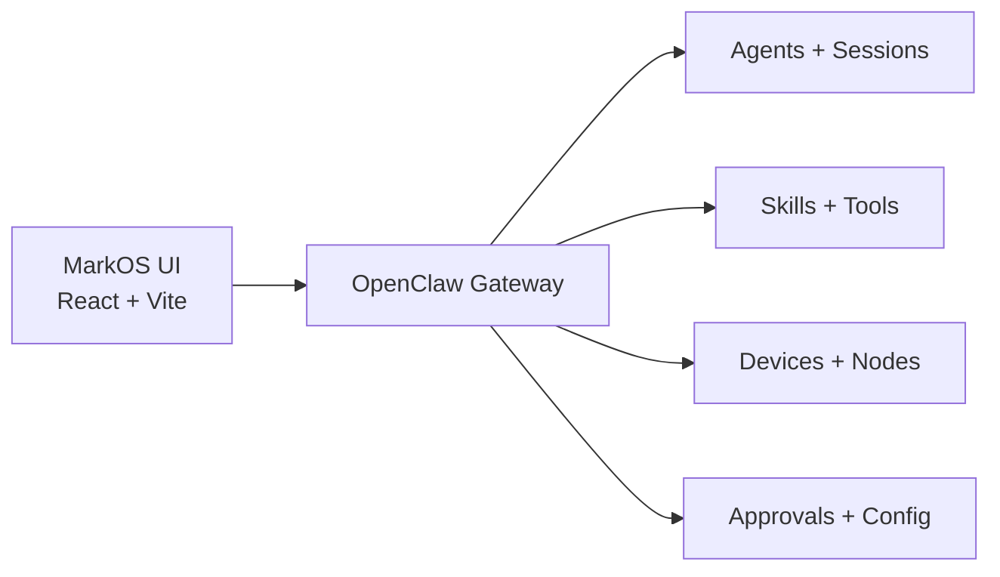

<div align="center">
  <h1>MarkOS UI</h1>
  <p><strong>A visual control plane for OpenClaw-powered agent systems.</strong></p>
  <p>Build, monitor, and orchestrate AI agents from a polished dashboard with live gateway connectivity, offline fallback, and one-click deployment flows.</p>

  <p>
    <a href="https://github.com/mktt-ai-global/MarkOS-UI/stargazers"></a>
    <a href="https://github.com/mktt-ai-global/MarkOS-UI/blob/main/LICENSE"></a>
    <a href="https://github.com/mktt-ai-global/MarkOS-UI/actions/workflows/ci.yml"></a>
    <a href="https://github.com/mktt-ai-global/MarkOS-UI/actions/workflows/release.yml"></a>
    
    
  </p>
</div>



## One-Click Install

### Local preview

```bash
bash <(curl -fsSL https://raw.githubusercontent.com/mktt-ai-global/MarkOS-UI/main/install.sh)
```

The installer opens an interactive menu and lets you choose:

- local preview mode
- host and UI port
- OpenClaw gateway port
- whether to bootstrap OpenClaw for live mode
- a final deployment summary before any changes are made

### VPS production deploy

```bash
bash <(curl -fsSL https://raw.githubusercontent.com/mktt-ai-global/MarkOS-UI/main/install.sh) --mode vps --domain ai.example.com --email ops@example.com
```

VPS mode is designed for public deployment and will:

- build the frontend
- configure Nginx as a reverse proxy
- proxy `/ws`, `/v1`, and `/tools` to OpenClaw
- install a systemd service for the OpenClaw gateway
- issue a Let's Encrypt certificate
- enable `certbot.timer` for automatic certificate renewal

If you use interactive mode, the installer also includes built-in prompts for domain and port configuration.
Before execution, it prints a step-by-step deployment plan, warns about busy ports or DNS mismatches when it can detect them, and shows maintenance commands after completion.

### Docker deploy

```bash
docker compose up -d --build
```

Or:

```bash
./install.sh --mode docker
```

Docker mode exposes the UI on a configurable host port and proxies API and WebSocket traffic to an upstream OpenClaw gateway.

## Why It Feels Different

Most agent runtimes are powerful but invisible. MarkOS UI makes them operable.

Instead of forcing users into a pile of config files and shell history, it gives them a product-grade operator surface for:

- live gateway visibility
- agent and skill browsing
- template-driven workflows
- chat and cron previews
- device and approval scaffolding
- polished desktop and mobile layouts

The goal is simple: make agent infrastructure feel as understandable as modern cloud ops.

## Core Features

- **Dashboard with graceful fallback**: monitor nodes, sessions, skills, gateway health, and derived activity metrics even when the gateway is offline.
- **Agent workspace**: browse agents, inspect runtime visibility, and create reusable local agent templates from structured questionnaires.
- **Skill studio**: import files, build skill templates, preview artifacts, and prepare runtime-ready packs.
- **Chat console**: inspect sessions, launch offline template-based conversations, and prepare local session override drafts.
- **Cron preview**: model scheduled jobs and local run history before enabling live runtime writes.
- **Devices and approvals**: ship a ready product shell for trusted-device management and human approval flows.
- **Template import pipeline**: supports `.md`, `.txt`, `.json`, `.yaml`, `.yml`, and `.rtf`.
- **Responsive UI**: built for both desktop operations and mobile browsing.

## Install Modes

| Mode | Best For | What It Does |
| --- | --- | --- |
| `local` | Laptop demo, product review, local testing | Builds the app, optionally starts OpenClaw, and runs a local preview server |
| `vps` | Public domain deployment | Builds the app, configures Nginx, installs a gateway service, enables HTTPS auto-renew |
| `docker` | Fast container-based startup | Builds a container image and serves the app with Nginx |
| `config` | Infra teams and manual rollout | Generates Nginx and systemd config files without modifying the host |

## Built-In Domain And Port Configuration

The new installer includes an interactive menu with configurable deployment inputs:

- `Domain`
- `Host`
- `UI port`
- `Gateway port`
- `HTTP port`
- `HTTPS port`
- `Install directory`
- `Docker upstream host`

For production HTTPS with automatic Let's Encrypt renewal, the installer normalizes to ports `80/443`, because that is the most reliable setup for certificate issuance and renewal.

## Post-Deploy Verification

After the installer completes, it prints mode-specific maintenance commands. The most useful checks are:

- Local: `openclaw status`
- VPS: `sudo systemctl status nginx --no-pager`
- VPS: `sudo systemctl status markos-openclaw-gateway.service --no-pager`
- VPS: `sudo certbot renew --dry-run`
- Docker: `docker compose ps`
- Docker: `docker compose logs -f`

## CLI Examples

### Local mode with custom ports

```bash
./install.sh --mode local --host 0.0.0.0 --ui-port 5000 --gateway-port 19000
```

### VPS mode with domain and TLS

```bash
./install.sh --mode vps --domain ai.example.com --email ops@example.com --gateway-port 18789
```

### Docker mode with custom host port

```bash
./install.sh --mode docker --ui-port 8080 --gateway-port 18789 --docker-upstream-host host.docker.internal
```

### Generate deployment config only

```bash
./install.sh --mode config --domain ai.example.com --install-dir /srv/markos-ui
```

## Docker Configuration

`docker-compose.yml` supports these environment variables:

- `MARKOS_UI_PORT`
- `OPENCLAW_UPSTREAM_HOST`
- `OPENCLAW_UPSTREAM_PORT`

Example:

```bash
MARKOS_UI_PORT=8080 OPENCLAW_UPSTREAM_HOST=host.docker.internal OPENCLAW_UPSTREAM_PORT=18789 docker compose up -d --build
```

## Local Development

```bash
git clone https://github.com/mktt-ai-global/MarkOS-UI.git
cd MarkOS-UI
npm ci
npm run dev
```

Open [http://localhost:5173](http://localhost:5173)

## Scripts

```bash
npm run dev
npm run lint
npm run test
npm run build
npm run check
npm run preview
npm run docker:build
npm run docker:up
npm run package:release
```

## Release Workflow

- Pull requests and branch pushes run [`ci.yml`](./.github/workflows/ci.yml)
- Version tags like `vX.Y.Z` trigger [`release.yml`](./.github/workflows/release.yml)
- Release notes can be refined with [`docs/RELEASE_TEMPLATE.md`](./docs/RELEASE_TEMPLATE.md)
- Release steps are tracked in [`docs/RELEASE_CHECKLIST.md`](./docs/RELEASE_CHECKLIST.md)
- Manual source packaging remains available via `./scripts/package-release.sh HEAD vX.Y.Z`
- Artifact checksums are written to `release/MarkOS-UI-vX.Y.Z-SHA256SUMS.txt`

## Architecture



When OpenClaw is online, the UI reads live snapshots and events. When it is not, MarkOS UI falls back to local mock data and browser-persisted drafts so product reviews and template workflows never block on infrastructure readiness.

## Stack

| Layer | Technology |
| --- | --- |
| App | React 19 + TypeScript |
| Build | Vite 8 |
| Styling | Tailwind CSS 4 |
| Routing | React Router 7 |
| Charts | Recharts 3 |
| Motion | Framer Motion |
| Runtime packaging | Nginx + Docker Compose + systemd |

## Project Structure

```text
src/pages        Route-level product surfaces
src/components   Shared UI building blocks
src/lib          Gateway client, adapters, storage, template helpers
src/hooks        Gateway-facing React hooks
deploy           Nginx and systemd templates
docker           Container runtime configuration
scripts          Release packaging helpers
tests            Local logic coverage
```

## Release Notes

- `npm run check` passes locally.
- `npm audit --omit=dev` passes locally.
- `install.sh` now supports local, VPS, Docker, and config-only flows.
- `install.sh` shows a deployment summary, preflight warnings, step-by-step progress, and troubleshooting hints.
- GitHub Actions CI, tag-based release automation, issue templates, and PR templates are included.
- `CONTRIBUTING.md` and `SECURITY.md` document contribution and vulnerability reporting expectations.

## License

[MIT](./LICENSE)
