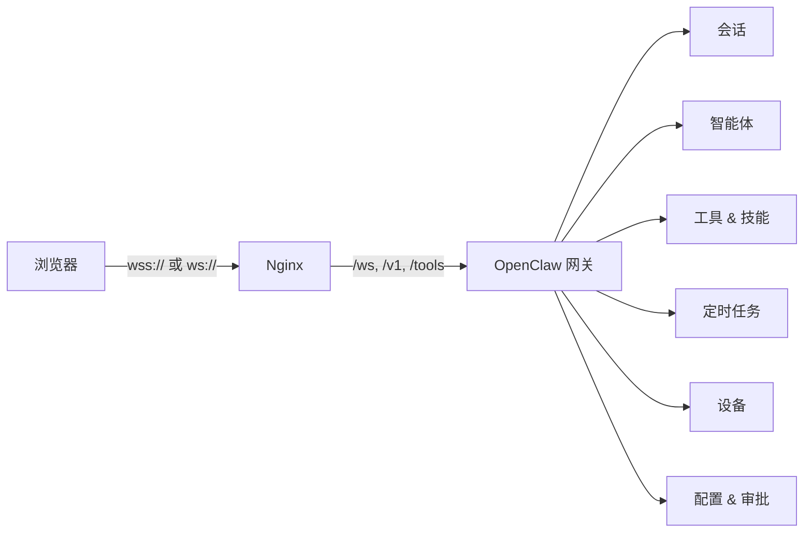

<div align="center">
  <h1>MarkOS UI</h1>
  <p><strong>OpenClaw 智能体操作系统界面</strong></p>
  <p>从精致的仪表盘构建、监控和编排 AI 智能体，支持网关实时连接和一键部署。</p>

  <p>
    <a href="https://github.com/mktt-ai-global/MarkOS-UI/stargazers"></a>
    <a href="https://github.com/mktt-ai-global/MarkOS-UI/blob/main/LICENSE"></a>
    <a href="https://github.com/mktt-ai-global/MarkOS-UI/actions/workflows/ci.yml"></a>
    <a href="https://github.com/mktt-ai-global/MarkOS-UI/releases/latest"></a>
    
    
  </p>

  <p>
    <a href="#快速开始">快速开始</a> &middot;
    <a href="#功能特性">功能特性</a> &middot;
    <a href="#部署模式">部署</a> &middot;
    <a href="#本地开发">开发</a> &middot;
    <a href="./README.md">English</a>
  </p>
</div>


## 快速开始

### 一键安装

```bash
bash <(curl -fsSL https://raw.githubusercontent.com/mktt-ai-global/MarkOS-UI/main/install.sh)
```

交互式安装器会引导你选择部署模式（本地 / VPS / Docker），配置端口，并可选地启动 OpenClaw 网关。所有操作前都会显示部署计划供你确认。

### Docker 部署

```bash
cp .env.example .env   # 按需修改端口
docker compose up -d
```

打开 `http://localhost:4173`，连接你的网关即可使用。

### VPS 生产部署（带 HTTPS）

```bash
bash <(curl -fsSL https://raw.githubusercontent.com/mktt-ai-global/MarkOS-UI/main/install.sh) \
  --mode vps --domain ai.example.com --email ops@example.com
```

自动完成：构建前端 → 配置 Nginx 反向代理 → 安装 systemd 网关服务 → 签发 Let's Encrypt 证书 → 启用自动续期。

## 功能特性

### 网关实时连接

MarkOS UI 通过 WebSocket 连接 OpenClaw 网关。连接时所有页面显示实时数据；断开时自动回退到本地模拟数据，不影响 UI 浏览。

- **仪表盘** — 节点、会话、智能体、技能、性能指标一览
- **智能体** — 浏览 `agents.list` 返回的智能体，查看会话和 Token 用量
- **技能** — 从网关获取工具目录，按类别分组展示
- **对话** — 通过 `chat.send` / `chat.history` 实时收发消息，实时事件流
- **定时任务** — 创建/修改/运行/删除定时任务
- **设备** — 查看已配对和待审批的浏览器设备
- **审批** — 执行审批策略管理
- **设置** — 实时配置查看器、连接管理、网关 Schema 编辑器

### 智能连接

- 自动检测部署环境：本地开发用 `ws://localhost:18789`，远程域名用 `wss://<域名>/ws`
- Ed25519 设备签名（v2 协议，兼容 OpenClaw 2026.3.23+）
- 设备身份过期自动恢复（无需手动清缓存）
- 支持 URL 哈希传递 Token（`#token=...`），首次连接零配置

### 模板工作室

通过结构化问卷或导入已有文件（`.md`、`.txt`、`.json`、`.yaml`、`.yml`、`.rtf`）创建智能体和技能模板。实时预览生成的工件，支持打包下载。

### 设计系统

- 毛玻璃（Glassmorphism）UI，支持 `frost`（浅色）和 `midnight`（深色）主题
- `glass-input` 输入组件，聚焦时带氛围光效
- 桌面端和移动端自适应布局
- Framer Motion 流畅动画

## 部署模式

| 模式 | 适用场景 | 说明 |
|------|----------|------|
| `local` | 本地演示、测试 | 构建应用，可选启动 OpenClaw，运行预览服务器 |
| `vps` | 公网部署 | Nginx 反代 + systemd 服务 + HTTPS 自动续期 |
| `docker` | 容器化部署 | Nginx 容器，含网关代理和健康检查 |
| `config` | 手动部署 | 仅生成 Nginx 和 systemd 配置文件 |

### 命令行示例

```bash
# 本地自定义端口
./install.sh --mode local --host 0.0.0.0 --ui-port 5000 --gateway-port 19000

# VPS 绑定域名
./install.sh --mode vps --domain ai.example.com --email ops@example.com

# Docker 自定义端口
./install.sh --mode docker --ui-port 8080

# 仅生成配置文件
./install.sh --mode config --domain ai.example.com
```

### Docker 配置

复制 `.env.example` 为 `.env` 并编辑：

```env
MARKOS_UI_PORT=4173                          # 浏览器访问端口
OPENCLAW_UPSTREAM_HOST=host.docker.internal   # 网关地址
OPENCLAW_UPSTREAM_PORT=18789                  # 网关端口
```

Nginx 容器内置 gzip 压缩、静态资源缓存、安全响应头、`/healthz` 健康检查端点和 WebSocket 反代。

## 架构



## 技术栈

| 层级 | 技术 |
|------|------|
| 前端 | React 19、TypeScript |
| 构建 | Vite 8 |
| 样式 | Tailwind CSS 4 |
| 路由 | React Router 7 |
| 图表 | Recharts 3 |
| 动画 | Framer Motion |
| 部署 | Nginx、Docker Compose、systemd |

## 本地开发

```bash
git clone https://github.com/mktt-ai-global/MarkOS-UI.git
cd MarkOS-UI
npm ci
npm run dev
```

打开 [http://localhost:5173](http://localhost:5173)。开发服务器会自动将 `/ws`、`/v1`、`/tools` 代理到 `localhost:18789`。

### 常用命令

| 命令 | 说明 |
|------|------|
| `npm run dev` | 启动开发服务器 |
| `npm run build` | 生产构建 |
| `npm run preview` | 预览生产构建 |
| `npm run lint` | ESLint 检查 |
| `npm run test` | 运行测试 |
| `npm run check` | Lint + 测试 + 构建 |
| `npm run docker:up` | 构建并启动 Docker |

### 项目结构

```
src/
  pages/         页面组件（仪表盘、智能体、技能、对话等）
  components/    共享 UI 组件（GlassCard、侧边栏、顶栏等）
  lib/           网关客户端、适配器、存储、模板引擎
  hooks/         网关数据和事件的 React Hooks
deploy/          Nginx 和 systemd 模板
docker/          容器运行时配置
tests/           单元测试
```

## 发布流程

- PR 和推送会触发 [`ci.yml`](./.github/workflows/ci.yml)（lint + 类型检查 + 测试 + 构建）
- 版本标签（`vX.Y.Z`）触发 [`release.yml`](./.github/workflows/release.yml)
- 手动打包：`./scripts/package-release.sh HEAD vX.Y.Z`

## 参与贡献

请参阅 [CONTRIBUTING.md](./CONTRIBUTING.md)。

## 安全

请参阅 [SECURITY.md](./SECURITY.md) 了解漏洞报告流程。

## 许可证

[MIT](./LICENSE)
